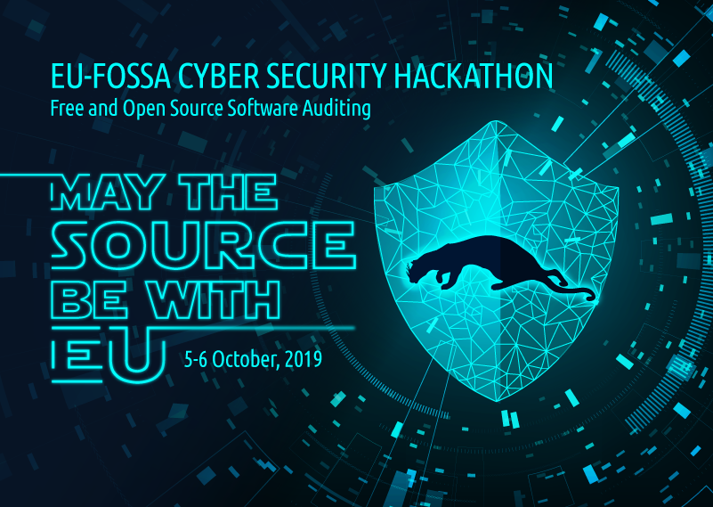

# OSS Cyber Security Hackathon

After two successful [hackathons](https://eufossahackathon.bemyapp.com/), which strengthened the security of open source software PHP Symfony, API Platform and projects from the Apache Software Foundation; the third hackathon focusses on the security of the EU's developed open source projects.

During the weekend of 5/6 October, close to 100 developers and software architects from internal project teams and leading open source software experts from around the world, will gather in Brussels at [Silversquare Triomphe](https://silversquare.eu/location/triomphe/) to work on strengthening a select set of EU projects.

This is an EU first, and an ideal showcase of how the European Commission and institutions contribute not only to open source, but also to Cyber Security.

This event falls at the start of October, EU's [CyberSecMonth](https://cybersecuritymonth.eu/), and we expect Europe wide live streaming of the key events, and possible coverage by Euro News.

## About EU-FOSSA

The [EU-FOSSA](https://ec.europa.eu/info/departments/informatics/eu-fossa-2_en) project - short for Free and Open Source Software Auditing - aims to increase the security and integrity of critical open source software.

It was launched by the European Commission at the instigation of the European Parliament after the discovery of the Heartbleed bug in 2014.

Following the success of an initial pilot, the project was renewed for another three years.

This builds on the pilot project by extending the auditing of free and open source software through:

* setting up bug bounty programmes,
* organising hackathons, and
* engaging with developer communities.

In addition, EU-FOSSA is expanding its scope to a wider range of software projects and communities. Since the very same software used by the European institutions is also widely deployed in society, we are all already benefitting from these investments.
